<div align="center">

# 🧠 Customer Churn Intelligence

### Deep Learning–Powered E-Commerce Customer Churn Prediction

**An end-to-end deep learning system that transforms customer behavioral, transactional, demographic, and temporal data into actionable churn-risk intelligence.**

<br>


<br>


<br>

> **Customer Data → Behavioral Intelligence → Deep Learning → Churn Probability → Retention Action**

<br>

**Developed by P. S. Aravind**

</div>

---

# 📌 Table of Contents

* [Executive Summary](#-executive-summary)
* [Problem Statement](#-problem-statement)
* [Business Context](#-business-context)
* [Solution Architecture](#-solution-architecture)
* [Dataset](#-dataset)
* [Feature Engineering](#-feature-engineering)
* [Data Pipeline](#-data-pipeline)
* [Deep Learning Architecture](#-deep-learning-architecture)
* [Training Strategy](#-training-strategy)
* [Prediction Pipeline](#-prediction-pipeline)
* [Model Evaluation](#-model-evaluation)
* [Streamlit Application](#-streamlit-application)
* [Technology Stack](#-technology-stack)
* [Repository Architecture](#-repository-architecture)
* [Installation](#-installation)
* [Running the Project](#-running-the-project)
* [Production Architecture](#-production-architecture)
* [Explainable AI](#-explainable-ai)
* [MLOps Roadmap](#-mlops-roadmap)
* [Responsible AI](#-responsible-ai)
* [Security](#-security)
* [Limitations](#-limitations)
* [Future Roadmap](#-future-roadmap)
* [Author](#-author)

---

# 🚀 Executive Summary

Customer churn is one of the most important predictive problems in modern e-commerce.

A customer rarely explicitly announces an intention to leave. Churn instead emerges from combinations of purchasing behavior, transaction history, product interactions, returns, demographics, payment preferences, and temporal activity.

This project develops an **end-to-end deep learning churn intelligence system** capable of learning these relationships and estimating the probability that a customer will churn.

The solution combines:

```text
┌──────────────────────┐
│  E-Commerce Dataset  │
└──────────┬───────────┘
           ▼
┌──────────────────────┐
│   Data Engineering   │
└──────────┬───────────┘
           ▼
┌──────────────────────┐
│  Feature Engineering │
└──────────┬───────────┘
           ▼
┌──────────────────────┐
│ Encoding + Scaling   │
└──────────┬───────────┘
           ▼
┌──────────────────────┐
│   Deep Neural Net    │
│   128 → 64 → 32 → 1 │
└──────────┬───────────┘
           ▼
┌──────────────────────┐
│  Churn Probability   │
└──────────┬───────────┘
           ▼
┌──────────────────────┐
│ Streamlit Dashboard  │
└──────────────────────┘
```

The project covers the complete workflow from raw customer data to deployable inference.

---

# 🎯 Problem Statement

## The Business Problem

Customer acquisition can require substantial marketing expenditure, while customer attrition reduces future revenue and customer lifetime value.

The challenge is therefore not simply:

> **“Which customers have already left?”**

The more valuable question is:

> **“Which customers show patterns associated with churn before intervention becomes impossible?”**

This project addresses that challenge through supervised deep learning.

---

## Mathematical Formulation

Given a customer represented by a feature vector:

[
X=(x_1,x_2,\ldots,x_n)
]

the objective is to estimate:

[
P(Y=1|X)
]

where:

[
Y=
\begin{cases}
1 & \text{Customer Churn}\
0 & \text{Customer Retained}
\end{cases}
]

The neural network therefore learns a nonlinear function:

[
f_\theta(X) \rightarrow [0,1]
]

where (\theta) represents the learned network parameters.

---

# 💼 Business Context

A churn model is valuable only when predictions can support action.

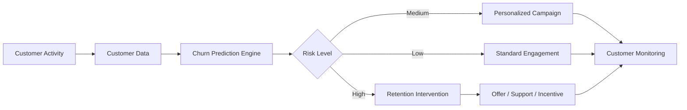

### Business Applications

| Function            | Potential Application                       |
| ------------------- | ------------------------------------------- |
| 🎯 Marketing        | Target customers with elevated churn risk   |
| 🤝 CRM              | Add churn intelligence to customer profiles |
| 💰 Revenue          | Protect potential future customer value     |
| 📊 Analytics        | Discover behavioral churn patterns          |
| 🛍️ E-Commerce      | Personalize retention incentives            |
| 📞 Customer Success | Prioritize proactive outreach               |
| 🧠 Management       | Support data-driven retention decisions     |

---

# 🏗️ Solution Architecture

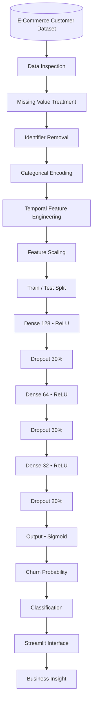

---

# 📊 Dataset

The project uses the:

### **E-commerce Customer for Behavior Analysis Dataset**

The dataset is retrieved programmatically using KaggleHub.

```python
import kagglehub

path = kagglehub.dataset_download(
    "shriyashjagtap/e-commerce-customer-for-behavior-analysis"
)
```

The dataset contains multiple dimensions of customer behavior.

---

## 🧩 Feature Categories

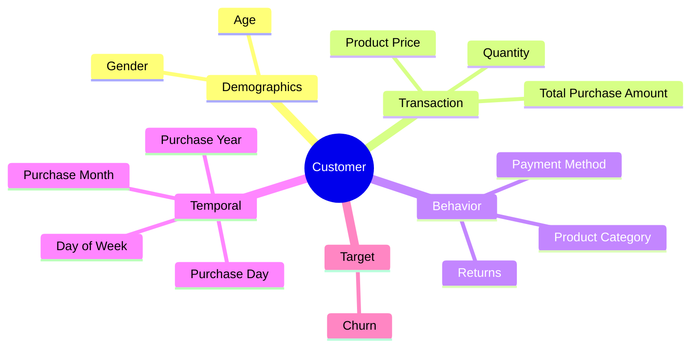

---

# 🧬 Feature Engineering

Raw customer data cannot be passed directly into the neural network.

The project therefore converts raw information into a model-ready numerical representation.

---

## Feature Transformation

| Raw Feature      | Transformation          | Output                       |
| ---------------- | ----------------------- | ---------------------------- |
| Customer ID      | Removed                 | —                            |
| Customer Name    | Removed                 | —                            |
| Age              | Standardization         | Numerical                    |
| Gender           | One-Hot Encoding        | Binary Features              |
| Product Category | One-Hot Encoding        | Binary Features              |
| Payment Method   | One-Hot Encoding        | Binary Features              |
| Returns          | Missing-value treatment | Numerical                    |
| Purchase Date    | Temporal decomposition  | Year / Month / Day / Weekday |
| Purchase Amount  | Standardization         | Numerical                    |

---

## Why Remove Identifiers?

```text
Customer ID ─────┐
                 ├──► Removed
Customer Name ───┘
```

Customer identifiers generally represent identity rather than transferable customer behavior.

Removing them reduces the risk that the model memorizes individual records rather than learning generalizable patterns.

---

# 🗓️ Temporal Intelligence

The raw purchase timestamp is decomposed into structured calendar features.

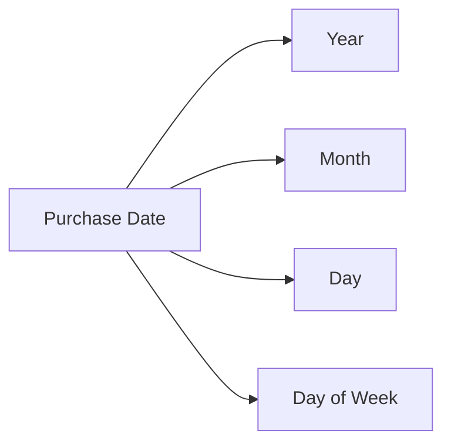

This allows the network to potentially learn temporal relationships in customer purchasing activity.

---

# ⚙️ Data Pipeline

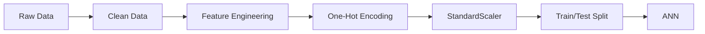

---

## Standardization

Continuous features are transformed using:

[
z=\frac{x-\mu}{\sigma}
]

where:

* (x) = original feature
* (\mu) = training mean
* (\sigma) = training standard deviation
* (z) = standardized feature

This helps create a numerically stable optimization environment for the neural network.

---

# 🧠 Deep Learning Architecture

The predictive engine uses a **fully connected Artificial Neural Network** built with TensorFlow/Keras.

<div align="center">

```text
                 CUSTOMER FEATURE VECTOR
                          │
                          ▼
                ┌─────────────────┐
                │      INPUT      │
                │   n Features    │
                └────────┬────────┘
                         │
                         ▼
                ┌─────────────────┐
                │     DENSE       │
                │   128 Neurons   │
                │      ReLU       │
                └────────┬────────┘
                         │
                         ▼
                ┌─────────────────┐
                │     DROPOUT     │
                │       30%       │
                └────────┬────────┘
                         │
                         ▼
                ┌─────────────────┐
                │     DENSE       │
                │   64 Neurons    │
                │      ReLU       │
                └────────┬────────┘
                         │
                         ▼
                ┌─────────────────┐
                │     DROPOUT     │
                │       30%       │
                └────────┬────────┘
                         │
                         ▼
                ┌─────────────────┐
                │     DENSE       │
                │   32 Neurons    │
                │      ReLU       │
                └────────┬────────┘
                         │
                         ▼
                ┌─────────────────┐
                │     DROPOUT     │
                │       20%       │
                └────────┬────────┘
                         │
                         ▼
                ┌─────────────────┐
                │     OUTPUT      │
                │    1 Neuron     │
                │    Sigmoid      │
                └────────┬────────┘
                         │
                         ▼
                 CHURN PROBABILITY
```

</div>

---

## Network Specification

| Stage | Layer   |             Units | Activation | Dropout |
| ----: | ------- | ----------------: | ---------- | ------: |
|    01 | Input   | Feature dependent | —          |       — |
|    02 | Dense   |               128 | ReLU       |       — |
|    03 | Dropout |                 — | —          |     30% |
|    04 | Dense   |                64 | ReLU       |       — |
|    05 | Dropout |                 — | —          |     30% |
|    06 | Dense   |                32 | ReLU       |       — |
|    07 | Dropout |                 — | —          |     20% |
|    08 | Output  |                 1 | Sigmoid    |       — |

---

# 🔥 Activation Functions

## Hidden Layers — ReLU

[
ReLU(x)=max(0,x)
]

ReLU enables the network to model nonlinear interactions while maintaining efficient gradient-based optimization.

---

## Output Layer — Sigmoid

[
\sigma(x)=\frac{1}{1+e^{-x}}
]

The final output lies within:

[
0 \le P(\text{Churn}) \le 1
]

making it suitable for probabilistic binary classification.

---

# 🛡️ Regularization

Three Dropout layers are used.

```text
128 Neurons
    │
    ├──── Drop 30%
    ▼
64 Neurons
    │
    ├──── Drop 30%
    ▼
32 Neurons
    │
    ├──── Drop 20%
    ▼
Prediction
```

Dropout reduces dependence on individual neurons during training and helps limit overfitting.

---

# ⚡ Training Strategy

```python
model.compile(
    optimizer="adam",
    loss="binary_crossentropy",
    metrics=["accuracy"]
)
```

---

## Hyperparameters

| Parameter           |             Configuration |
| ------------------- | ------------------------: |
| 🧠 Model            | Artificial Neural Network |
| ⚙️ Optimizer        |                      Adam |
| 📉 Loss             |       Binary Crossentropy |
| 📊 Training Metric  |                  Accuracy |
| 🔁 Epochs           |                        20 |
| 📦 Batch Size       |                        32 |
| 🧪 Test Size        |                       20% |
| 🔍 Validation Split |                       20% |
| 🎯 Output           |         Churn Probability |

---

# 📉 Binary Crossentropy

The optimization objective is:

[
L=-[y\log(p)+(1-y)\log(1-p)]
]

The network learns parameters that minimize the difference between predicted probabilities and observed churn labels.

---

# 🔮 Prediction Pipeline

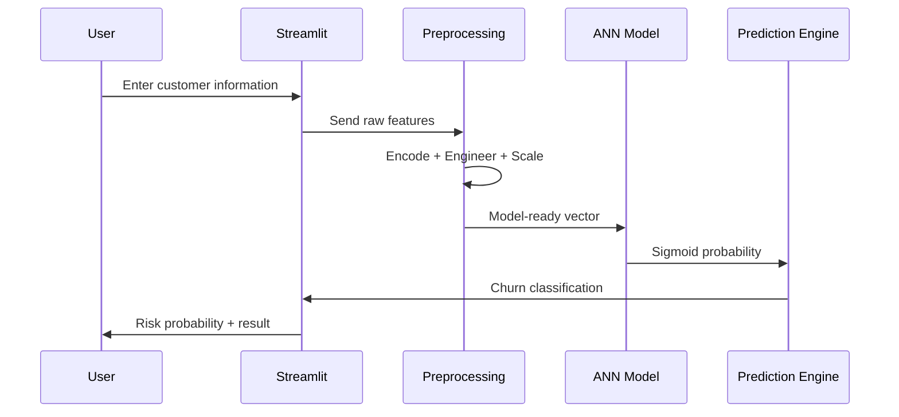

---

# 🚦 Risk Classification

The current binary decision boundary is:

[
Threshold=0.50
]

```text
                    MODEL OUTPUT
                         │
                         ▼
                 Churn Probability
                         │
                         ▼
                ┌────────────────┐
                │ Probability ≥ .5│
                └───────┬────────┘
                    YES │ NO
             ┌──────────┴──────────┐
             ▼                     ▼
       🔴 LIKELY              🟢 UNLIKELY
       TO CHURN               TO CHURN
```

For production applications, the threshold should be optimized based on business objectives and the relative cost of false positives and false negatives.

---

# 📈 Model Evaluation

A professional churn model should be evaluated beyond accuracy.

### Recommended Evaluation Matrix

| Metric           | Interpretation               | Importance |
| ---------------- | ---------------------------- | ---------- |
| Accuracy         | Overall correctness          | ⭐⭐⭐        |
| Precision        | Reliability of churn alerts  | ⭐⭐⭐⭐       |
| Recall           | Detection of actual churners | ⭐⭐⭐⭐⭐      |
| F1-Score         | Precision/Recall balance     | ⭐⭐⭐⭐⭐      |
| ROC-AUC          | Ranking capability           | ⭐⭐⭐⭐⭐      |
| PR-AUC           | Performance under imbalance  | ⭐⭐⭐⭐⭐      |
| Confusion Matrix | Error distribution           | ⭐⭐⭐⭐⭐      |

> **Note:** Exact metric values should be reported from the held-out evaluation output. They should never be estimated or invented for presentation purposes.

---

# 📊 Recommended Evaluation Dashboard

Once generated, your repository can contain:

```text
┌──────────────────────────────────────────────────────────┐
│                  MODEL PERFORMANCE                       │
├──────────────┬──────────────┬──────────────┬─────────────┤
│   Accuracy   │  Precision   │    Recall    │  F1-Score   │
│      —       │      —       │      —       │      —      │
└──────────────┴──────────────┴──────────────┴─────────────┘

              ┌──────────────────────┐
              │      ROC CURVE       │
              │                      │
              │     ╭──────────      │
              │   ╭─╯                │
              │ ╭─╯                  │
              │╯                     │
              └──────────────────────┘

              ┌──────────────────────┐
              │   CONFUSION MATRIX   │
              ├──────────┬───────────┤
              │    TN    │    FP     │
              ├──────────┼───────────┤
              │    FN    │    TP     │
              └──────────┴───────────┘
```

Add real exported plots to `assets/` once generated.

---

# 🖥️ Streamlit Application

The model is exposed through an interactive Streamlit interface.

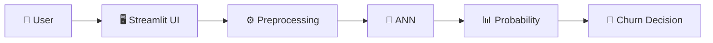

---

## User Inputs

The interface accepts customer information including:

* Customer age
* Gender
* Product price
* Quantity
* Total purchase amount
* Product category
* Payment method
* Return information
* Purchase date

---

## Example Prediction

```text
╔══════════════════════════════════════════╗
║       CUSTOMER CHURN INTELLIGENCE        ║
╠══════════════════════════════════════════╣
║                                          ║
║ Customer Risk Classification             ║
║                                          ║
║              🔴 HIGH RISK                ║
║                                          ║
║ Churn Probability                        ║
║ ████████████████████░░░░      78.4%      ║
║                                          ║
║ Recommendation                           ║
║ Initiate retention intervention          ║
║                                          ║
╚══════════════════════════════════════════╝
```

---

# 💾 Model Persistence

Training and production inference are separated through model serialization.

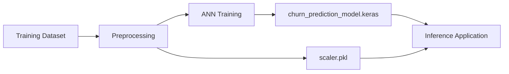

### Saved Model

```text
churn_prediction_model.keras
```

Stores the trained neural-network parameters and architecture.

### Saved Scaler

```text
scaler.pkl
```

Stores preprocessing statistics learned from the training data.

---

# 🧰 Technology Stack

<div align="center">

| Layer               | Technology       | Role                  |
| ------------------- | ---------------- | --------------------- |
| 💻 Language         | **Python**       | Core development      |
| 🧠 Deep Learning    | **TensorFlow**   | Model training        |
| 🔥 Neural Network   | **Keras**        | ANN architecture      |
| ⚙️ Machine Learning | **Scikit-learn** | Preprocessing         |
| 🐼 Data             | **Pandas**       | Data manipulation     |
| 🔢 Numerical        | **NumPy**        | Numerical computing   |
| 📦 Dataset          | **KaggleHub**    | Dataset acquisition   |
| 💾 Serialization    | **Joblib**       | Scaler persistence    |
| 🖥️ Frontend        | **Streamlit**    | Prediction UI         |
| 📊 Visualization    | **Plotly**       | Interactive analytics |
| 📓 Development      | **Jupyter**      | Experimentation       |
| 🔀 Version Control  | **Git/GitHub**   | Source management     |

</div>

---

# 📁 Repository Architecture

```text
Customer-Churn-Prediction/
│
├── 📓 Customer_Churn_Prediction.ipynb
│   └── Data processing, training & experimentation
│
├── 🖥️ app.py
│   └── Streamlit inference application
│
├── 🧠 churn_prediction_model.keras
│   └── Trained deep learning model
│
├── ⚙️ scaler.pkl
│   └── Fitted feature scaler
│
├── 📦 requirements.txt
│   └── Python dependencies
│
├── 📂 assets/
│   ├── architecture.png
│   ├── app-preview.png
│   ├── training-history.png
│   ├── confusion-matrix.png
│   └── roc-curve.png
│
├── 🔐 .gitignore
│
├── 📜 LICENSE
│
└── 📖 README.md
```

---

# 🖼️ Recommended Repository Visuals

For a genuinely polished GitHub repository, create an `assets` directory.

```text
assets/
├── hero-banner.png
├── model-architecture.png
├── churn-dashboard.png
├── app-preview.png
├── training-history.png
├── confusion-matrix.png
├── roc-curve.png
└── feature-importance.png
```

Then add them to the README:

```html
<p align="center">
  
</p>
```

For the application:

```html
<p align="center">
  
</p>
```

For evaluation:

```html
<p align="center">
  
  
</p>
```

This is substantially more professional than relying entirely on emojis and text diagrams.

---

# ⚙️ Installation

## 1 — Clone

```bash
git clone <YOUR_REPOSITORY_URL>
cd Customer-Churn-Prediction
```

---

## 2 — Virtual Environment

### Windows

```bash
python -m venv .venv
.venv\Scripts\activate
```

### Linux / macOS

```bash
python3 -m venv .venv
source .venv/bin/activate
```

---

## 3 — Dependencies

```bash
pip install -r requirements.txt
```

---

# ▶️ Running the Project

## Notebook

```bash
jupyter notebook Customer_Churn_Prediction.ipynb
```

## Streamlit Application

```bash
streamlit run app.py
```

---

# 🏭 Production Architecture

A production version could evolve into the following architecture:

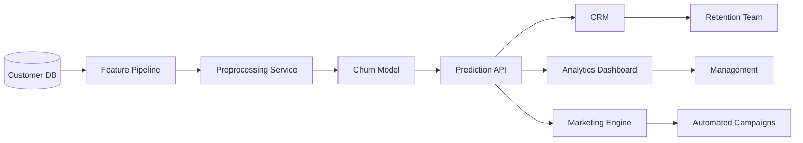

---

# 🔌 API Architecture

A future REST API could expose model inference to other applications.

### Request

```json
{
    "customer_age": 35,
    "gender": "Male",
    "product_price": 120.50,
    "quantity": 3,
    "total_purchase_amount": 361.50,
    "payment_method": "Credit Card",
    "returns": 0
}
```

### Response

```json
{
    "prediction": "churn",
    "churn_probability": 0.784,
    "risk_level": "high"
}
```

---

# 🔍 Explainable AI

A production churn model should explain predictions rather than functioning entirely as a black box.

A future SHAP integration could transform:

```text
Prediction
    │
    ▼
78% Churn Risk
```

into:

```text
78% CHURN RISK
      │
      ├── ↑ High return behavior
      ├── ↑ Reduced purchase activity
      ├── ↑ Low transaction frequency
      ├── ↓ Recent purchase
      └── ↓ Higher customer value
```

This makes the model substantially more useful to business decision-makers.

---

# ♻️ ML Lifecycle

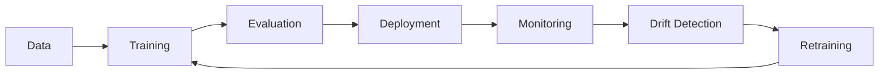

A deployed model should be treated as a continuously monitored system rather than a static artifact.

---

# 🧪 Experimentation Roadmap

Future experiments should benchmark the ANN against:

| Model               | Category          | Status        |
| ------------------- | ----------------- | ------------- |
| Logistic Regression | Baseline          | ⬜ Planned     |
| Random Forest       | Ensemble          | ⬜ Planned     |
| XGBoost             | Gradient Boosting | ⬜ Planned     |
| LightGBM            | Gradient Boosting | ⬜ Planned     |
| CatBoost            | Gradient Boosting | ⬜ Planned     |
| ANN                 | Deep Learning     | ✅ Implemented |

Model selection should ultimately depend on generalization performance, interpretability, computational cost, latency, and operational requirements.

---

# 📈 Future Evaluation Assets

The repository should eventually include actual exported charts.

### Training History

```text
Loss
│\
│ \
│  \___ Training
│      \____
│
│   \______ Validation
│
└──────────────────── Epoch
```

### ROC Curve

```text
TPR
1.0 │              ███████
    │          ████
    │       ███
    │     ██
    │   ██
    │ ██
0.0 └─────────────────────
    0.0                 1.0
              FPR
```

Use real plots from the trained model rather than decorative fabricated metrics.

---

# 🧭 MLOps Roadmap

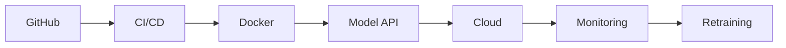

### Potential Engineering Upgrades

* Docker containerization
* FastAPI inference service
* GitHub Actions
* Unit and integration testing
* MLflow experiment tracking
* Model registry
* Dataset versioning
* Automated retraining
* Prediction logging
* Data-drift detection
* Performance monitoring

---

# 🛡️ Responsible AI

Machine-learning systems processing customer information require responsible deployment.

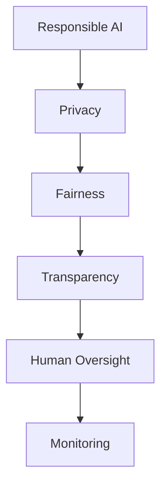

### Privacy

Only necessary customer information should be collected and retained.

### Fairness

Model behavior across demographic groups should be evaluated before production deployment.

### Transparency

Predictions represent statistical estimates—not guaranteed customer behavior.

### Human Oversight

High-impact business decisions should not rely exclusively on automated churn predictions.

---

# 🔐 Security

Never commit secrets directly into notebooks or source code.

### Never Commit

```text
❌ API Keys
❌ Passwords
❌ Kaggle Credentials
❌ ngrok Tokens
❌ Database Credentials
❌ Cloud Secrets
❌ Private Keys
```

Use environment variables:

```python
import os

NGROK_TOKEN = os.getenv("NGROK_AUTH_TOKEN")
```

Recommended `.gitignore`:

```gitignore
# Secrets
.env
*.key
credentials.json

# Python
__pycache__/
*.pyc
.venv/
venv/

# Jupyter
.ipynb_checkpoints/

# OS
.DS_Store
Thumbs.db
```

> ⚠️ **Security Warning**
>
> If a token has already appeared in a Git commit, deleting it from the latest notebook is insufficient. Revoke/rotate the credential and remove it from repository history where appropriate.

---

# ⚠️ Limitations

The current system is a prototype/educational implementation.

Key limitations include:

* Performance depends on dataset quality.
* Historical patterns may not represent future customers.
* The fixed `0.50` threshold may not maximize business value.
* Customer churn definitions differ between organizations.
* Accuracy alone is insufficient for production validation.
* Dataset-specific patterns may not generalize across companies.
* Production deployment requires drift and performance monitoring.

---

# 🗺️ Development Roadmap

```text
PHASE 01 ━━━━━━━━━━━━━━━━━━━━━━━━━━━━━━━  COMPLETE
Data + Preprocessing + Feature Engineering

PHASE 02 ━━━━━━━━━━━━━━━━━━━━━━━━━━━━━━━  COMPLETE
Deep Learning Model

PHASE 03 ━━━━━━━━━━━━━━━━━━━━━━━━━━━━━━━  COMPLETE
Interactive Streamlit Application

PHASE 04 ━━━━━━━━━━━━━━━━━━━━━━━━━━━━━━━  PLANNED
Advanced Evaluation + Explainability

PHASE 05 ━━━━━━━━━━━━━━━━━━━━━━━━━━━━━━━  PLANNED
API + Docker + CI/CD

PHASE 06 ━━━━━━━━━━━━━━━━━━━━━━━━━━━━━━━  FUTURE
Production MLOps + Monitoring
```

### Development Checklist

* [x] Dataset acquisition
* [x] Data preprocessing
* [x] Feature engineering
* [x] ANN development
* [x] Dropout regularization
* [x] Model training
* [x] Model serialization
* [x] Streamlit inference UI
* [x] Interactive prediction visualization
* [ ] Confusion matrix
* [ ] Precision / Recall / F1
* [ ] ROC-AUC
* [ ] Threshold optimization
* [ ] SHAP explainability
* [ ] Hyperparameter optimization
* [ ] Model benchmarking
* [ ] Automated tests
* [ ] FastAPI service
* [ ] Docker
* [ ] GitHub Actions
* [ ] MLflow
* [ ] Cloud deployment
* [ ] Model monitoring

---

# 🧠 Engineering Concepts Demonstrated

<div align="center">

| Data Science          | Deep Learning  | Engineering             |
| --------------------- | -------------- | ----------------------- |
| Data Cleaning         | ANN            | Model Serialization     |
| Feature Engineering   | Dense Networks | Inference Pipeline      |
| One-Hot Encoding      | ReLU           | Streamlit               |
| Standardization       | Sigmoid        | Git/GitHub              |
| Train/Test Split      | Dropout        | Application Integration |
| Binary Classification | Adam           | Deployment Fundamentals |

</div>

---

# 🤝 Contributing

Contributions are welcome.

```bash
git checkout -b feature/improvement

git add .

git commit -m "feat: add improvement"

git push origin feature/improvement
```

Open a pull request with a clear explanation of the proposed improvement.

---

# 📜 Disclaimer

This project is intended for:

**Education • Research • Experimentation • Portfolio Demonstration**

The model should not be treated as a production customer-management system without additional validation.

Any real-world deployment should include:

* domain validation,
* security assessment,
* privacy review,
* bias evaluation,
* threshold optimization,
* model monitoring,
* and human oversight.

---

# 👨‍💻 Author

<div align="center">

## P. S. Aravind

### AI & Data Science Student

**Building intelligent systems at the intersection of data, AI and real-world decision-making.**

`Artificial Intelligence` • `Machine Learning` • `Deep Learning`
`Data Science` • `Predictive Analytics` • `ML Engineering`

<br>

**Customer Churn Prediction — Deep Learning Project**

</div>

---

# ⭐ Support

<div align="center">

### Found this project useful?

Give the repository a **⭐ Star**

Fork it • Experiment with it • Improve it • Build on it

<br>

### 🧠 From Raw Data to Customer Intelligence

**Data → Features → Neural Network → Probability → Decision**

<br>

**Built with Python + TensorFlow by P. S. Aravind**

</div>
